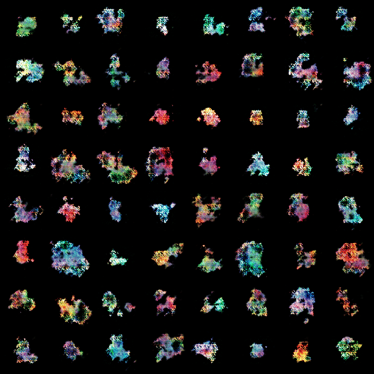
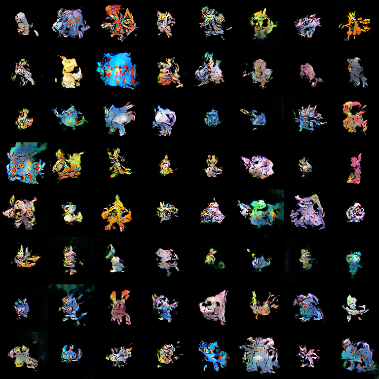

# DCGAN for Pokemon(ish) Generation

A Deep Convolutional GAN implementation for generating Pokémon images, with a focus on training stability and high-quality generation.

## Training Stability Challenges and Solutions

Training GANs is notoriously difficult, and this project faced several unique challenges:

1. **Small Dataset Size**
   - The Pokémon dataset is extremely small compared to typical GAN training datasets
   - This leads to overfitting and mode collapse
   - Solutions:
     - Data augmentation with DiffAugment
     - Gradient penalty to prevent discriminator from becoming too confident
     - Feature matching loss to encourage diversity

2. **Training Instability**
   - GANs are inherently unstable due to the adversarial nature of training
   - Solutions implemented:
     - Spectral normalization in discriminator
     - Gradient clipping
     - Careful learning rate scheduling
     - Batch normalization in generator
     - LeakyReLU activations in discriminator

3. **Mode Collapse**
   - Generator tends to produce limited variety of samples
   - Solutions:
     - Feature matching loss
     - Multiple discriminator updates per generator update
     - Diverse noise sampling

## Model Architecture

The successful model uses a CNN-based architecture with careful design choices:

### Generator
```python
Generator(
  (initial): Sequential(
    (0): ConvTranspose2d(50, 512, kernel_size=(6, 6))
    (1): BatchNorm2d(512)
    (2): ReLU()
  )
  (upsampling_layers): ModuleList(
    (0): Sequential(512 -> 512)
    (1): Sequential(512 -> 256)
    (2): Sequential(256 -> 128)
    (3): Sequential(128 -> 64)
  )
  (final): Sequential(
    (0): Conv2d(64, 3, kernel_size=(3, 3))
    (1): Tanh()
  )
)
```

### Discriminator
```python
Discriminator(
  (initial): Sequential(
    (0): Conv2d(3, 64, kernel_size=(3, 3))
    (1): LeakyReLU(0.2)
  )
  (downsampling_layers): ModuleList(
    (0): Sequential(64 -> 128)
    (1): Sequential(128 -> 256)
    (2): Sequential(256 -> 512)
    (3): Sequential(512 -> 1024)
  )
  (final): Conv2d(1024, 1, kernel_size=(6, 6))
)
```

Key architectural features:
- Progressive upsampling in generator
- Spectral normalization in discriminator
- Batch normalization in generator
- LeakyReLU in discriminator
- Careful channel dimension progression

## Results

Here's the progression of generated images using fixed noise over training:



And here's the last non-collapsed epoch (epoch 230), showing the best quality achieved before mode collapse:



Ultimately, the model is able to get to a point where it can generate some decent images. Though we still face model collapse not too long after.

## Additional Results

### CIFAR-10 Pretraining

To demonstrate the model's capabilities on a larger dataset, we also trained it on CIFAR-10. The larger dataset size (50,000 images vs. ~800 Pokémon) allows for more stable training and better results:


The CIFAR-10 results show that the architecture is capable of generating high-quality images when trained on a sufficiently large dataset. This suggests that the challenges we face with the Pokémon dataset are primarily due to its small size rather than architectural limitations.

## Training Techniques

1. **Loss Functions**
   - Adversarial loss with label smoothing
   - Feature matching loss for diversity
   - Gradient penalty for stability

2. **Optimization**
   - Adam optimizer with β1=0.5, β2=0.999
   - Learning rate of 2e-4
   - Gradient clipping at 1.0

3. **Training Process**
   - Multiple discriminator updates per generator update
   - Batch size of 8 for Pokémon dataset
   - Image size of 96x96
   - Regular checkpointing and visualization

## Requirements

```
torch>=1.9.0
torchvision>=0.10.0
numpy>=1.19.0
matplotlib>=3.3.0
imageio>=2.9.0
```

## Usage

### Training

```bash
python src/main.py --dataset pokemon --model CNN --image_size 96 --batch_size 8
```

### Generating GIFs

```bash
python src/make_gifs.py runs/your_run_name
```

## Project Structure

```
.
├── src/
│   ├── main.py           # Main training script
│   ├── train.py          # Training utilities
│   ├── cnn.py           # CNN model architecture
│   ├── vit.py           # ViT model architecture
│   ├── make_gifs.py     # GIF generation utility
│   └── pokemon_data.py  # Dataset handling
├── results/
│   ├── decent/          # Example results
│   └── cifar10pretrain/ # CIFAR-10 results
└── README.md
```
